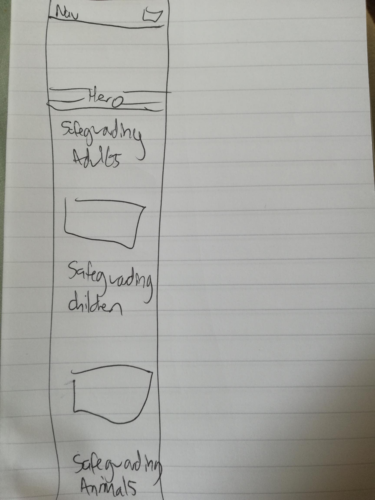
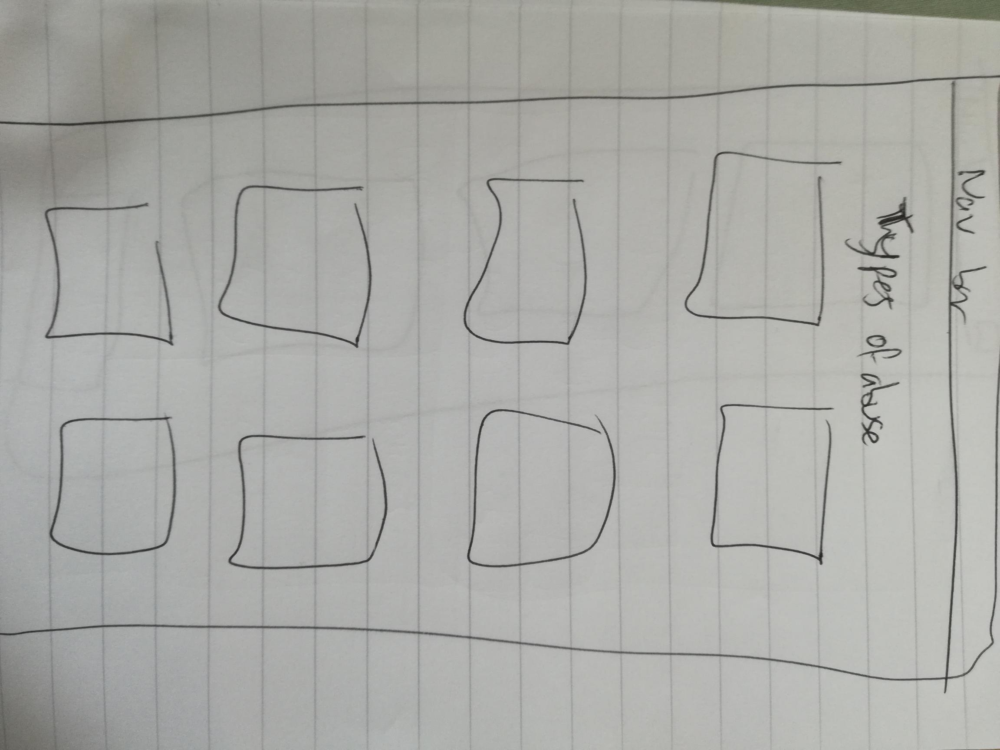
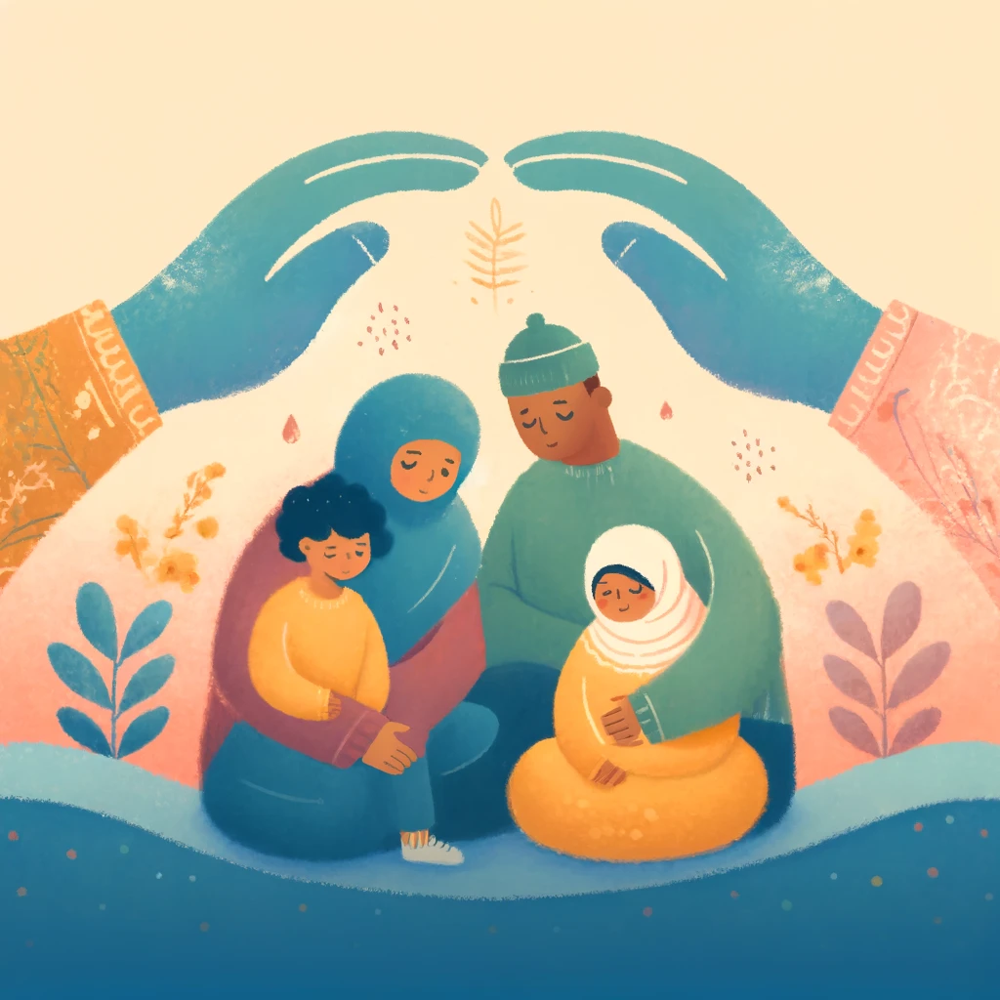

The Safeguarding Guide

The live project can be found here: [link to live project](https://github.com/Mi-Py-1/Safeguarding)

 [The Safeguarding Guide. A website dedicated to increasing safeguarding best practice and sharing knowledge. A project using HTML 5 | CSS3 | Bootstrap.]

Introduction

The Safeguarding Guide is my first project as part of the Code Institute Full Stack Development for the AI Augmented Developer 16 week Bootcamp. It is designed as an unassessed project over 3 days to enable me to demonstrate what I have learned in HTML, CSS, Bootstrap and AI in the first 5 weeks of the course.

Responsivity examples:

Contents:
- 

Project Outline:

The Safeguarding Guide is a fictional organisation who's objective is to provide upto date information to both professionals and members of the public and will cover adults, children and animals. They will also provide training and community outreach. 

The final deliverable will showcase aspects of my learning from the last 5 weeks in HTML, CSS, Bootstrap and AI support. It is important that the correct design choices are made for this to ensure that the site is responsive to modern devices, adheres to accessibility requirements and is aesthetically pleasing for a user to navigate. 

Key Objectives:
- Information and best practice resources available to site visitors.
- To be appealing to anyone who might use it.
- To provide training events and advertise these.
- To offer a contact page with further contact information.
- Responsive design.
- Pleasing imagery.

 

UX Design 

 

User Stories

User Story: As a professional, I would like to access up to date legal information about safeguarding so that I can stay up to date.

User Story: As a website visitor, I want a user-friendly Contact Us page so that I can easily get in touch with the team to raise concerns or discuss more of what the site offers.

User Story: As a professional, I would like to access up to date legal information about safeguarding so that I can stay up to date.

User Story: As a website visitor, I want to read testimonials from previous users so that I can trust the quality of the training and advice offered.

User Story: As a site user I want to see clear explanations of what safeguarding is and further information.

User Story: As a Site User, I want to navigate easily through the website so that I can find the information I need.

User Story: I want to see a visually engaging and stylised website.

 

Colours

The colour pallet was chosen based on the main hero image. This was to ensure all aspects could be pulled together pleasingly. I used coolors.co to generate a pallet out of the image and checked these with Colour Contrast Checker. Initially I was unsure about the colour pallet and so used variable tags in css so I could change it later if I wished. I chose not to in the end. Before I used my colour pallet i tested it with the Colour Contrast Checker (https://colourcontrast.cc/)

Main Pallet:

--white: #ffffff; text
--midnight-green: #1A4B56; background
--orange-peel: #F89900; highlight / hover

 

Fonts:

Fonts were important in the creation of this website to ensure that it looked visually pleasing and inviting. This was especially important as some site users may be accessing the site in times of distress.

The font was chosen with google fonts. The font is Sour Gummy:

@import url('https://fonts.googleapis.com/css2?family=Sour+Gummy:ital,wght@0,100..900;1,100..900&display=swap');

WireFrames:

Images:

Images have been taken from freepik. The hero image was generated by Dall-E 3 AI now part of ChatGPT. This required several iterations to create something that fitted the needs of the Hero image. I tried to use this software to create further similar images that would then remain in keeping throughout however, Dall-e now restricts you to 3 images per day without membership and this made it impratical to generate enough suitable images to remain consistent.  

Images taken to be visually pleasing and reflect brand but to avoid being distressing or triggering. Images must also promote inclusivity and avoid stereotypes. Image had to look ok on smaller screen even if edges were lost.

Features: 

Navbar: I added a navbar using bootstrap and then styled this. I added a font awesome icon to make the website name appear more appealing and filled in some of the expected links. I styled the navbar using the pallete colors and included a "contact me" button to link to a later contact page and form. I linked the contact us button to the contact page however this cameback as an error for embedding a button inside an anchor.

Hero Section: Initially I tried to type the code for this myself but had issues with implemetning it so I copied bits of code from a previous project (love running) to achieve this. I utilised the hero image and styled with similar styles from navbar and footer. I experimented with adding some media links to the edges of the hero text however even after completing this I did not like the appearance of them so I removed them.

Introduction and embedded youtube videos: I added these in order to support the introduction and provide links to further information simultaneously.

Carousel: taken from bootstrap and added to provide more of a visual navigation on the homepage to other areas of the site. 

Footer: I added a basic footer and included the font awesome icon to base the other information around. I added another "contact me" button and included some links for policy and copywrite information. I styled these and used copilot to support spacing.

Cards: I began adding a card design from bootstrap to the types of abuse section but this was unfinished.

Contact form: I added and styled a contact form from bootstrap on the contact page using bootstrap.

Subscription form: I added and styled a subscription form from bootstrap.

 

Tablet/mobile View:

Pages are styled to reduce size on smaller and larger devices as expected wih the wireframes. 

Future Features:

At the start of this project I had tried to type out some of my own code for some features such as the introduction box and the footer in order to pratice my knowledge. Although this worked and looked pleasing, by the second day I discovered issues when varying the size of the screen displayed on. Part way through some advice I had from copilot I wanted to reset to an earlier repository but in doing this lost some work which I had to spend time redoing. This also with the tendancy of my bluetooth keyboard to discconnect for half seconds at a time created a lot of bug fixing during the project and this took up almost the whole of my second day. This meant there were a lot of simple tasks I was unable to complete within the time frame that I had intended to. Such as:

A Calendar to show upcoming training.

Testimonials from previous attendees of the training.

A success page upon completing the contact message form.

Finished cards detailing signs of abuse with further links.

Links to up to date legal policy and information.

Further resources.

Information on Animal Safeguarding.

 

Technologies used in this project:

Languages: HTML5, CSS3, Bootstrapv5.3.3.
Frameworks: Bootstrapv5.3.3 Font Awesome, Google Fonts
Libraries: freepik
Programs: visual studio code, github, gitpod, miro, copilot, dall-e (Chatgpt)

 

Deployment:

This Github project was created as a blank project with a blank readme file. The initial HTML code was automated using !

Setup a repo using this method and template:

    Login to your GitHub profile.
    Navigate to the Code Institute Full Template
    Click the dropdown for 'Use this template' and select "Create a new repository"
    Generate the necessary name and description for your repo and click 'Create repository from template'
    Navigate to the new repo and click the green 'Open' button with the Gitpod logo
    IMPORTANT - This button should only be clicked once to generate the new IDE workspace
    You can now work on your repository within the Code Institute Gitpod IDE workspace

Once the project repo is created, an early deployment for the live project should performed.
This allows for early and continuous testing using a variety of devices, as well as the Dev Tools available within browsers.

Additional information on the deployment process can be found on the official GitHub Docs

 

Testing: 

HTML has been checked with a HTML validator - https://validator.w3.org/

CSS has been checked with a CSS validator - https://jigsaw.w3.org/css-validator/

